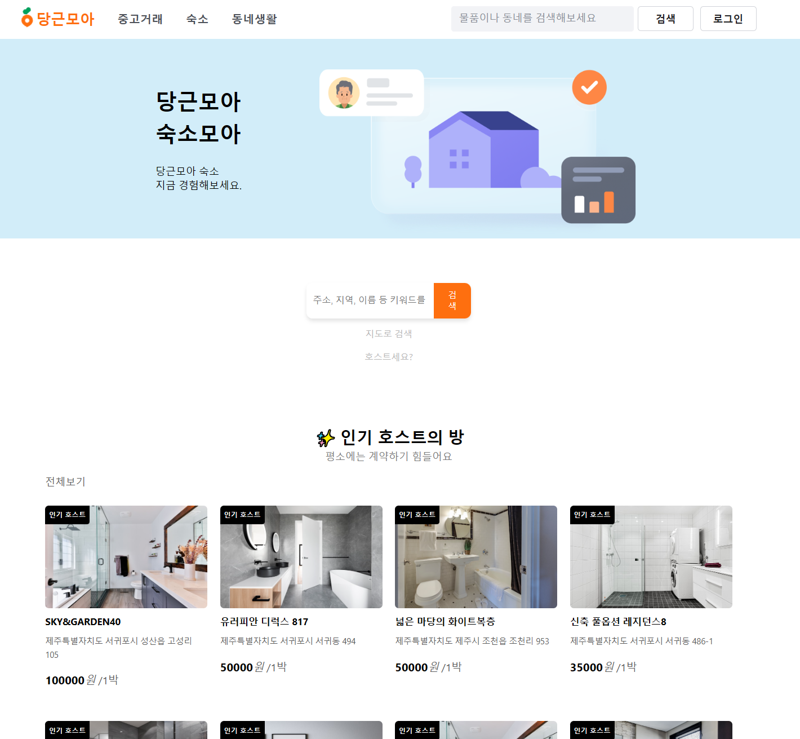
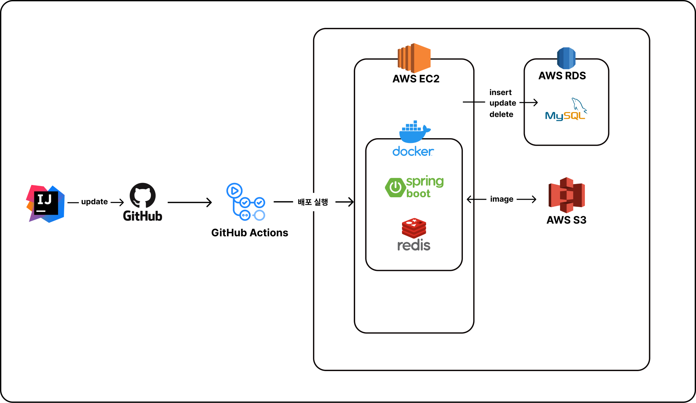
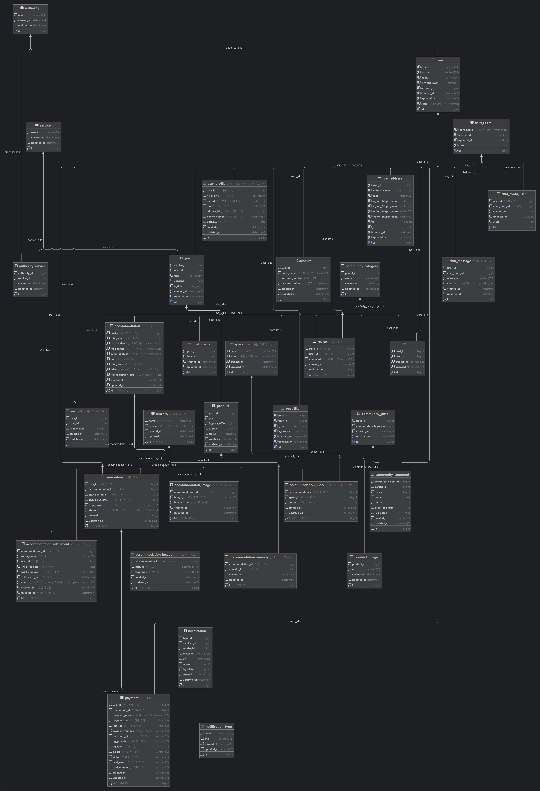

# [당근모아] 중고거래, 동네생활, 숙소 예약 서비스 플랫폼

```
📍 중고거래 동네생활 및 숙소 예약 서비스 플랫폼 입니다.
```

---



---

- [💡 서비스 배경 및 목표](#💡-서비스-배경-및-목표)
- [🛠️ 기술 스택](#🛠️-기술-스택)
- [🗺️ 서버 구조](#🗺️-서버-구조)
- [🗂️ 패키지 구조](#🗂️-패키지-구조)
- [🔥 기술적 개선 및 고려](#🔥-기술적-개선-및-고려)

---

## 💡 서비스 배경 및 목표

지역 기반 플랫폼의 수요가 증가함에 따라, 사용자들은 자신이 거주하는 지역의 소식과 서비스들을 한 곳에서 쉽게 이용하고자 합니다. 당근모아는 지역 커뮤니티와 상호작용할 수 있는 공간을 제공하며, 사용자들이 일상생활에서 필요한 다양한 정보와 거래를 편리하게 이용할 수 있도록 돕습니다.

당근모아 서비스 목표는 다음과 같습니다

- **목표 1. 지역 소식 및 소통 활성화 (동네 게시판)**  
  사용자가 지역 소식, 이벤트, 맛집 추천 등을 쉽게 확인하고, 이웃과 활발하게 소통할 수 있는 공간을 제공합니다.

- **목표 2. 간편한 중고 거래 서비스**  
  동네 주민들이 안전하고 편리하게 중고 물품을 거래할 수 있도록 돕습니다.

- **목표 3. 숙소 예약 서비스**  
  사용자가 숙소를 손쉽게 검색하고 예약할 수 있도록 지원하며, 호스트가 자신의 숙소를 효율적으로 관리할 수 있는 기능을 제공합니다.
  
## 🛠️ 기술 스택

| 분류       | 기술명                                                                        |
|----------|----------------------------------------------------------------------------|
| BackEnd  | Java, Spring (Boot, Security, JPA), QueryDsl, Redis, MySql                 |
| FrontEnd | HTML, Javascript, Thymeleaf                                                |
| DevOps   | EC2, RDS, S3, GithubAction                                                 |
| Tools    | IntelliJ, Gradle                                                           |

## 🗺️ 서버 구조



## 💾 DB 구조



## 🗂️ 패키지 구조

```
- src
    - main
        - java
            - carrotmoa
                - carrotmoa
                    - config
                        - (log, mail, redis, security, websocket..)
                    - controller
                        - api
                        - view
                    - entity
                    - enums
                    - exception
                    - model
                        - request
                        - response
                    - repository
                    - service
                    - util
                    
```

## 🔥 기술적 개선 및 고려

```
다음과 같은 구조로 작성돼 있으니 참고부탁드립니다. 🙇

- 상황 및 목표 [link]
    - 목표 달성을 위한 행동
        - 결과 및 추가사항
```

### 서버 단에서의 유효성 검증 구현 [[적용 코드](https://github.com/rosa2070/carrotmoaNew/blob/535646bc5b71b36656337274dcef470df3c2a70e/src/main/java/carrotmoa/carrotmoa/controller/api/HostRoomApiController.java#L44-L73)]

- **클라이언트-서버 양방향 검증**:
    - `@Valid` 어노테이션을 사용하여 클라이언트에서 전달된 데이터가 서버 측에서도 유효한지 검증.
    - `BindingResult`를 통해 유효성 검증 결과를 처리하고, 오류가 발생하면 명확한 오류 메시지를 반환하여 데이터 정확성을 확보.
    - 클라이언트와 서버에서 각각 데이터 검증을 수행하여 오류 가능성을 최소화하고 신뢰성을 높임.


### Spring AOP를 활용한 통합 로그 구현 [[적용 코드](https://github.com/rosa2070/carrotmoaNew/blob/535646bc5b71b36656337274dcef470df3c2a70e/src/main/java/carrotmoa/carrotmoa/util/LoggingAspect.java)]

- **자동 로그 기록**
    - `AOP`를 활용하여 API 컨트롤러 메서드에서 `requestDTO`를 자동으로 로그에 기록.
    - 메서드마다 로그 코드를 반복 작성할 필요 없이 중앙에서 관리하여 유지보수를 용이하게 함.
    - 각 요청과 응답에 대한 로그를 자동으로 기록하여 디버깅 및 모니터링에 효과적.

### 명시적인 상태 코드 반환 [[적용 코드](https://github.com/rosa2070/carrotmoaNew/blob/535646bc5b71b36656337274dcef470df3c2a70e/src/main/java/carrotmoa/carrotmoa/controller/api/HostRoomApiController.java#L103)]

- **구조화된 오류 응답**:
    - 예외 발생 시 `ResponseEntity`를 사용하여 적절한 HTTP 상태 코드와 함께 오류 메시지를 명확하게 반환.
    - 클라이언트가 오류를 쉽게 이해하고 대처할 수 있도록 구조화된 오류 응답 형식을 제공, API 안정성을 높임.

### 숙소 등록 프로세스 속도 개선 [[적용 코드](https://github.com/rosa2070/carrotmoaNew/blob/535646bc5b71b36656337274dcef470df3c2a70e/src/main/java/carrotmoa/carrotmoa/service/AccommodationSpaceService.java#L35)]

- **배치 처리로 속도 개선**:
    - 기존에는 반복문을 사용해 개별적으로 처리하던 방 등록 작업을 `Hibernate`의 `saveAll` 메서드를 사용하여 한 번에 여러 엔티티를 저장하도록 개선.
    - 배치 처리를 통해 왕복 통신 횟수를 최소화하고, 숙소 등록 프로세스 속도를 획기적으로 개선.

### 민감 정보 보호 및 암호화 [[적용 코드](https://github.com/rosa2070/carrotmoaNew/blob/535646bc5b71b36656337274dcef470df3c2a70e/src/test/java/carrotmoa/carrotmoa/config/JasyptConfigTestFinal.java) / [설정 코드](https://github.com/rosa2070/carrotmoaNew/blob/535646bc5b71b36656337274dcef470df3c2a70e/src/main/java/carrotmoa/carrotmoa/config/JasyptConfig.java)]

- **Jaspyt 암호화 적용**:
    - `Jaspyt` 라이브러리를 사용하여 `application.properties`에 저장된 민감한 정보(예: 데이터베이스 비밀번호)를 암호화하여 저장.
    - 데이터를 `ENC(…)` 형식으로 암호화해 저장하여 외부 유출 위험을 최소화하고 보안을 강화.

### S3 이미지 업로드 및 삭제 유틸리티 클래스 구현 [[적용 코드](https://github.com/rosa2070/carrotmoaNew/blob/535646bc5b71b36656337274dcef470df3c2a70e/src/main/java/carrotmoa/carrotmoa/util/AwsS3Utils.java) / [설정 코드](https://github.com/rosa2070/carrotmoaNew/blob/535646bc5b71b36656337274dcef470df3c2a70e/src/main/java/carrotmoa/carrotmoa/config/S3Config.java)]

- **공통 유틸리티 클래스 설계**:
    - AWS S3에 이미지 파일을 업로드하고 삭제하는 공통 유틸리티 클래스를 구현하여 코드의 재사용성을 높임.
    - `spring-cloud-aws-starter` 라이브러리를 도입하여 비동기 S3 클라이언트(`S3Client`)를 활용, 효율적인 비동기 작업을 구현.
    - 유틸리티 클래스를 통해 S3 관련 작업의 코드 중복을 줄이고, 코드 유지보수를 용이하게 함.

### 카테고리 목록 조회 성능 개선 [[적용 코드](https://github.com/rosa2070/carrotmoaNew/blob/535646bc5b71b36656337274dcef470df3c2a70e/src/main/java/carrotmoa/carrotmoa/config/S3Config.java) / [설정 코드](https://github.com/rosa2070/carrotmoaNew/blob/535646bc5b71b36656337274dcef470df3c2a70e/src/main/java/carrotmoa/carrotmoa/config/redis/RedisCacheConfig.java#L22-L31)]

- **Redis 캐시 적용**:
    - `@Cacheable` 어노테이션을 사용하여 카테고리 목록을 Redis에 캐시 처리하여 DB 조회 성능을 개선.
    - 카테고리 목록 조회 시간을 **40ms에서 10ms로 단축**시켜 사용자 경험을 크게 향상시킴.
    - `TTL(Time To Live)`을 하루로 설정하여 캐시된 데이터가 자동으로 만료되도록 하여 최신 정보를 반영.


### CI/CD 구축 및 보안 강화 [[설정 코드](https://github.com/rosa2070/carrotmoaNew/blob/6dd90c568e8333ba7ac1209ff2cd95ddd8f44cae/.github/workflows/gradle.yml)]

- **CI/CD 파이프라인 구축**:
    - `GitHub Actions`를 사용하여 CI/CD 파이프라인을 자동화하여 개발과 배포 과정의 효율성을 높임.
    - `JASYPT_PASSWORD`를 `GitHub Secrets`에 안전하게 관리하여 환경 변수 및 민감 정보를 보호.
    - Dockerfile에서 `ENTRYPOINT`를 사용하여 암호화된 비밀번호를 Java 시스템 속성으로 전달하여 보안을 강화.
    - **Docker run** 명령어를 통해 환경 변수 설정 및 보안을 강화하는 방식으로 배포 안정성을 확보.

