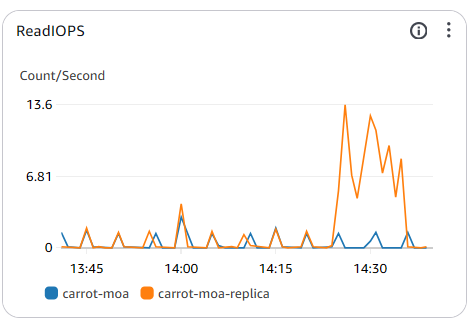
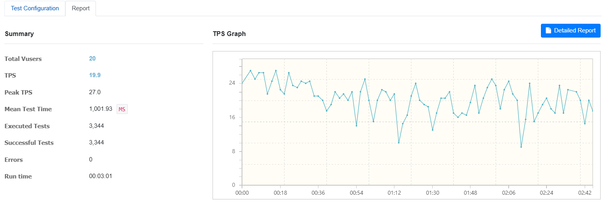
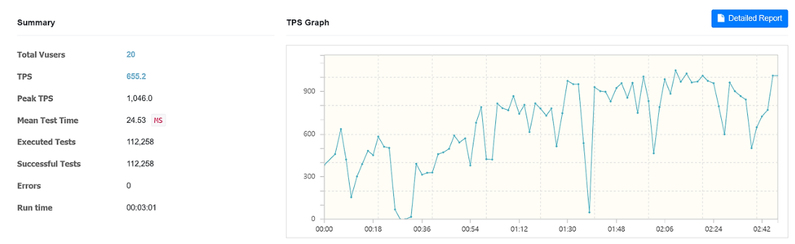
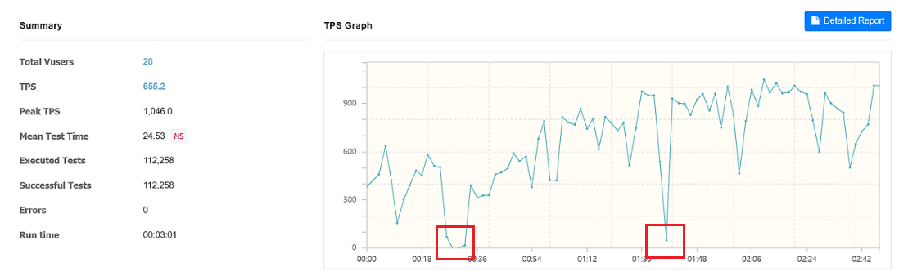
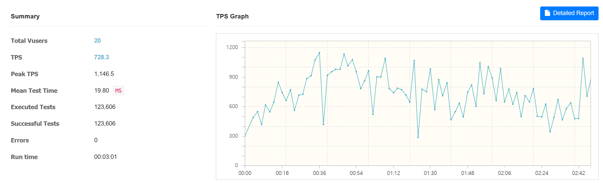

# [당근모아] 중고거래, 동네생활, 숙소 예약 서비스 플랫폼

```
📍 중고거래 동네생활 및 숙소 예약 서비스 플랫폼 입니다.
```

---


---

- [💡 서비스 배경 및 목표](#💡-서비스-배경-및-목표)
- [🛠️ 기술 스택](#🛠️-기술-스택)
- [🗺️ 서버 구조](#🗺️-서버-구조)
- [🗂️ 패키지 구조](#🗂️-패키지-구조)
- [🔥 기술적 개선 및 고려](#🔥-기술적-개선-및-고려)

---

## 💡 서비스 배경 및 목표

지역 기반 플랫폼의 수요가 증가함에 따라, 사용자들은 자신이 거주하는 지역의 소식과 서비스들을 한 곳에서 쉽게 이용하고자 합니다. 당근모아는 지역 커뮤니티와 상호작용할 수 있는 공간을 제공하며, 사용자들이 일상생활에서 필요한 다양한 정보와 거래를 편리하게 이용할 수 있도록 돕습니다.

당근모아 서비스 목표는 다음과 같습니다

- **목표 1. 지역 소식 및 소통 활성화 (동네 게시판)**  
  사용자가 지역 소식, 이벤트, 맛집 추천 등을 쉽게 확인하고, 이웃과 활발하게 소통할 수 있는 공간을 제공합니다.

- **목표 2. 간편한 중고 거래 서비스**  
  동네 주민들이 안전하고 편리하게 중고 물품을 거래할 수 있도록 돕습니다.

- **목표 3. 숙소 예약 서비스**  
  사용자가 숙소를 손쉽게 검색하고 예약할 수 있도록 지원하며, 호스트가 자신의 숙소를 효율적으로 관리할 수 있는 기능을 제공합니다.
  
## 🛠️ 기술 스택

| 분류       | 기술명                                                                        |
|----------|----------------------------------------------------------------------------|
| BackEnd  | Java, Spring (Boot, Security, JPA), QueryDsl, Redis, MySql                 |
| FrontEnd | HTML, Javascript, Thymeleaf                                                |
| DevOps   | EC2, RDS, S3, GithubAction                                                 |
| Tools    | IntelliJ, Gradle                                                           |

## 🗺️ 서버 구조


## 💾 DB 구조


## 🗂️ 패키지 구조

```
- src
    - main
        - java
            - carrotmoa
                - carrotmoa
                    - config
                        - (log, mail, redis, security, websocket..)
                    - controller
                        - api
                        - view
                    - entity
                    - enums
                    - exception
                    - model
                        - request
                        - response
                    - repository
                    - service
                    - util
                    
```

## 🔥 기술적 개선 및 고려

```
다음과 같은 구조로 작성돼 있으니 참고부탁드립니다. 🙇

- 상황 및 목표 [link]
    - 목표 달성을 위한 행동
        - 결과 및 추가사항
```

### **외부 API 호출에 대한 재시도 및 오류 처리** [[적용 코드](https://github.com/rosa2070/carrotmoaNew/blob/8d57e659c4751c02d65eceba4226cfea2c2a63f9/src/main/java/carrotmoa/carrotmoa/util/PaymentClient.java#L58-L100)]
- 외부 API 호출 시 `@Retryable`을 적용하여 네트워크 오류 발생 시 자동 재시도 수행
  - 일시적 네트워크 장애 발생 시, 재시도를 통해 요청 성공률 유지
- 400번대 오류(클라이언트 오류)는 `noRetryFor`를 활용하여 즉시 실패 처리
  - 불필요한 재시도를 방지하여 서버 및 네트워크 부하 감소
- `backoff(multiplier = 2)`를 설정하여 재시도 간격을 1초 → 2초 → 4초로 점진적으로 확대
  - 짧은 시간 내 동일 요청이 몰리는 것을 방지하여 서버 부하를 줄이고 안정성 개선

 ### DB에 대한 부하 분산 [[설정 코드](https://github.com/rosa2070/carrotmoaNew/blob/a3d7d2af82849763cf2bab0db1d9451468e5dae3/src/main/java/carrotmoa/carrotmoa/db/DataSourceConfig.java#L29-L133) / [구성 패키지](https://github.com/rosa2070/carrotmoaNew/tree/a3d7d2af82849763cf2bab0db1d9451468e5dae3/src/main/java/carrotmoa/carrotmoa/db)]

- 로컬/배포 환경에서 `DB 서버 이중화` 구성
    - 로컬 환경: MySQL DB 이중화
    - 배포 환경: aws RDS MySQL DB 이중화 

- Master-Slave DB 간의 `Write/Read 쿼리 분산` 적용
    - 옵션1. @Transactional의 readOnly 속성을 이용한 쿼리 분산
    - 옵션2. @RouteDataSource의 dataSourceType 속성을 이용한 쿼리 분산
    - (@Transactional: 스프링 어노테이션 / @RouteDataSource: 커스텀 어노테이션)

### AWS CloudWatch를 통한 DB 부하 분산 모니터링

- CloudWatch 대시보드 설정
  - Master DB(carrot-moa)와 Replica DB(carrot-moa-replica)의 Read IOPS, CPU 사용률, Replication Lag 등을 실시간으로 모니터링
- 10만 건의 더미 데이터를 추가한 후, nGrinder를 사용하여 50명의 가상 사용자(VUser)로 10분간 읽기 작업을 수행하며 부하 분산 효과 검증
- 성능 테스트 결과, Master DB의 Read IOPS는 일정하게 유지된 반면, Replica DB의 Read IOPS는 13.6까지 증가하여 Master DB 대비 약 6배 향상
  - 이를 통해 읽기 쿼리가 Replica DB로 성공적으로 분배되었음을 확인
  - 

### 인기 숙소 데이터 조회 최적화 [[적용 코드](https://github.com/rosa2070/carrotmoaNew/blob/a3d7d2af82849763cf2bab0db1d9451468e5dae3/src/main/java/carrotmoa/carrotmoa/service/BestAccommodationService.java#L39-L50) / [설정 코드](https://github.com/rosa2070/carrotmoaNew/blob/a3d7d2af82849763cf2bab0db1d9451468e5dae3/src/main/java/carrotmoa/carrotmoa/config/redis/RedisCacheConfig.java)]
- **Redis 캐시 적용**:
  - `@Cacheable` 어노테이션을 활용하여 인기 숙소 8개 데이터를 한 번에 JSON 형식으로 변환하여 Redis에 저장하고, 캐시 만료 기간을 1분으로 설정하여 최신 데이터를 유지하도록 처리.
  - 50만개의 더미 데이터를 넣고 nGrinder 부하 테스트를 진행한 결과, 캐싱 미적용 대비 약 **30배**의 TPS 성능 향상을 기록.
        <h4>[Ngrinder]</h4>
        <span>Cache 미적용</span>
        
        <span>Cache 적용</span>
        
 


### 캐시 스탬피드 해결을 위한 TTL 랜덤화 적용 [[적용 코드](https://github.com/rosa2070/carrotmoaNew/blob/a3d7d2af82849763cf2bab0db1d9451468e5dae3/src/main/java/carrotmoa/carrotmoa/config/redis/RedisCacheConfig.java#L60-L65)]
- **TTL 랜덤화 적용**:
  - 캐시의 만료 시간(TTL)을 일정 범위 내에서 랜덤하게 설정하여 캐시 만료 시점을 분산시킴.
  - 기본 TTL 값에 일정 범위 내에서 랜덤 값을 더하거나 빼는 방식으로 TTL을 계산하여 트래픽이 집중되는 시간을 피하고, 시스템의 안정성을 확보.
  - 부하 테스트 결과, TTL 랜덤화 후 TPS가 200 이하로 떨어지지 않음.

    <div>
        <h4>[Ngrinder]</h4>
        <span>캐시 스탬피드 현상 발생</span>
        
        <span>TTL 랜덤화 적용</span>
        
    </div>
  


### Nginx를 통한 로드밸런싱과 HTTPS 적용
- 로드밸런싱 설정
   - `upstream` 지시어로 두 서버(`localhost:8080`, `localhost:8081`)를 묶어 트래픽을 분배
   - 트래픽을 두 서버에 고르게 분배해 과부하를 방지하고, 안정적인 서비스 운영 가능
- HTTPS 적용
   - Certbot을 통해 SSL 인증서를 발급받고, `listen 443 ssl`로 HTTPS 설정
   - HTTP 요청이 올 경우 HTTPS로 강제 리다이렉션
   - 웹사이트의 데이터 전송 보안을 강화
### **로드밸런싱 환경에서의 세션 동기화 문제 해결**

- **문제 원인**:
  - 기존의 `HttpSession`은 서버의 메모리에 세션 정보를 저장하므로, 로드밸런싱 환경에서 서버 간 세션 동기화가 되지 않아 로그인 정보 불일치가 발생
- **해결**:
  - `spring-session-data-redis` 의존성을 추가하여 Redis 세션 저장소를 사용하도록 설정
    - 서버 간 세션 데이터를 공유하고 세션 정보를 외부 저장소에 중앙 집중화
- **결과**:
  - 로드밸런싱 환경에서도 세션 정보가 일관되게 유지되어 로그인 문제가 해결됨
  
 ### GitHub Actions를 사용한 CI/CD 파이프라인 구축 [[설정 코드](https://github.com/rosa2070/carrotmoaNew/blob/a3d7d2af82849763cf2bab0db1d9451468e5dae3/.github/workflows/gradle.yml)]

- Gradle 빌드를 실행하고, Docker 이미지를 생성하여 Docker Hub에 푸시한 후, EC2 서버에 배포하는 과정을 자동화
    - nginx 로드 밸런싱을 위해 EC2 배포 시, 두 개의 Docker 컨테이너를 8080과 8081 포트에서 각각 실행
- SSH 키, Docker Hub 로그인 정보 등 중요한 정보는 보안 강화를 위해  GitHub Secrets에 저장
 
### 서버 단에서의 유효성 검증 구현 [[적용 코드](https://github.com/rosa2070/carrotmoaNew/blob/a3d7d2af82849763cf2bab0db1d9451468e5dae3/src/main/java/carrotmoa/carrotmoa/controller/api/HostRoomApiController.java#L46-L60)]

- **클라이언트-서버 양방향 검증**:
    - `@Valid` 어노테이션을 사용하여 클라이언트에서 전달된 데이터가 서버 측에서도 유효한지 검증.
    - `BindingResult`를 통해 유효성 검증 결과를 처리하고, 오류가 발생하면 명확한 오류 메시지를 반환하여 데이터 정확성을 확보.
    - 클라이언트와 서버에서 각각 데이터 검증을 수행하여 오류 가능성을 최소화하고 신뢰성을 높임.

### Spring AOP를 활용한 통합 로그 구현 [[적용 코드](https://github.com/rosa2070/carrotmoaNew/blob/a3d7d2af82849763cf2bab0db1d9451468e5dae3/src/main/java/carrotmoa/carrotmoa/util/LoggingAspect.java)]

- **자동 로그 기록**
    - `AOP`를 활용하여 API 컨트롤러 메서드에서 `requestDTO`를 자동으로 로그에 기록.
    - 메서드마다 로그 코드를 반복 작성할 필요 없이 중앙에서 관리하여 유지보수를 용이하게 함.
    - 각 요청과 응답에 대한 로그를 자동으로 기록하여 디버깅 및 모니터링에 효과적.

### 명시적인 상태 코드 반환 [[적용 코드](https://github.com/rosa2070/carrotmoaNew/blob/a3d7d2af82849763cf2bab0db1d9451468e5dae3/src/main/java/carrotmoa/carrotmoa/controller/api/HostRoomApiController.java#L103)]

- **구조화된 오류 응답**:
    - 예외 발생 시 `ResponseEntity`를 사용하여 적절한 HTTP 상태 코드와 함께 오류 메시지를 명확하게 반환.
    - 클라이언트가 오류를 쉽게 이해하고 대처할 수 있도록 구조화된 오류 응답 형식을 제공, API 안정성을 높임.

### 민감 정보 보호 및 암호화 [[적용 코드](https://github.com/rosa2070/carrotmoaNew/blob/a3d7d2af82849763cf2bab0db1d9451468e5dae3/src/test/java/carrotmoa/carrotmoa/config/JasyptConfigTestFinal.java) / [설정 코드](https://github.com/rosa2070/carrotmoaNew/blob/a3d7d2af82849763cf2bab0db1d9451468e5dae3/src/main/java/carrotmoa/carrotmoa/config/JasyptConfig.java)]

- **Jaspyt 암호화 적용**:
    - `Jaspyt` 라이브러리를 사용하여 `application.properties`에 저장된 민감한 정보(예: 데이터베이스 비밀번호)를 암호화하여 저장.
    - 데이터를 `ENC(…)` 형식으로 암호화해 저장하여 외부 유출 위험을 최소화하고 보안을 강화.

### AWS S3 이미지 업로드 및 삭제 Utility 클래스 구현 [[적용 코드](https://github.com/rosa2070/carrotmoaNew/blob/a3d7d2af82849763cf2bab0db1d9451468e5dae3/src/main/java/carrotmoa/carrotmoa/util/AwsS3Utils.java) / [설정 코드](https://github.com/rosa2070/carrotmoaNew/blob/a3d7d2af82849763cf2bab0db1d9451468e5dae3/src/main/java/carrotmoa/carrotmoa/config/S3Config.java)]

- **이미지 업로드**:
    - UUID를 사용하여 파일명을 고유하게 생성함으로써, 파일 이름 충돌을 방지하고 안정적인 업로드를 보장
- **이미지 삭제**:
    - S3 파일 URL에서 객체 키를 정확하게 추출하는 메서드를 구현하여, 사용자가 의도한 파일만 안전하게 삭제할 수 있도록 지원
- **Utility 클래스 구현**:
    - S3와 관련된 파일 업로드 및 삭제 기능을 하나의 클래스에서 관리하여, 코드의 유지보수성을 높임

### 카테고리 목록 조회 성능 개선 [[적용 코드](https://github.com/rosa2070/carrotmoaNew/blob/a3d7d2af82849763cf2bab0db1d9451468e5dae3/src/main/java/carrotmoa/carrotmoa/service/CommunityCategoryService.java#L32-L38) / [설정 코드](https://github.com/rosa2070/carrotmoaNew/blob/535646bc5b71b36656337274dcef470df3c2a70e/src/main/java/carrotmoa/carrotmoa/config/redis/RedisCacheConfig.java#L22-L31)]

- **Redis 캐시 적용**:
    - `@Cacheable` 어노테이션을 사용하여 카테고리 목록을 Redis에 캐시 처리하여 DB 조회 성능을 개선.
    - 카테고리 목록 조회 시간을 **40ms에서 10ms로 단축**시켜 사용자 경험을 크게 향상시킴.
    - `TTL(Time To Live)`을 하루로 설정하여 캐시된 데이터가 자동으로 만료되도록 하여 최신 정보를 반영.

### 환경별 설정 최적화 [[설정 코드](https://github.com/rosa2070/carrotmoaNew/tree/a3d7d2af82849763cf2bab0db1d9451468e5dae3/src/main/resources)]
- Spring Boot의 `Profile`을 활용하여 환경별 설정을 효율적으로 관리
   - `application.yml`에서 기본 설정을 공통으로 관리하고, 각 환경(개발, 로컬, 프로덕션)에 맞는 설정을 `application-dev.yml`, `application-local.yml`, `application-prod.yml` 등으로 분리하여 관리.
   - 코드 변경 없이 환경별 최적화된 설정을 자동으로 로딩하도록 하여 유지보수의 용이성을 높임


    


  

